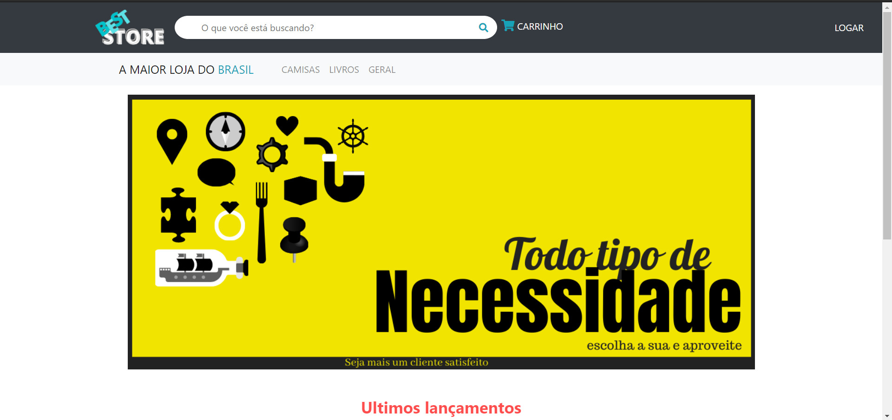
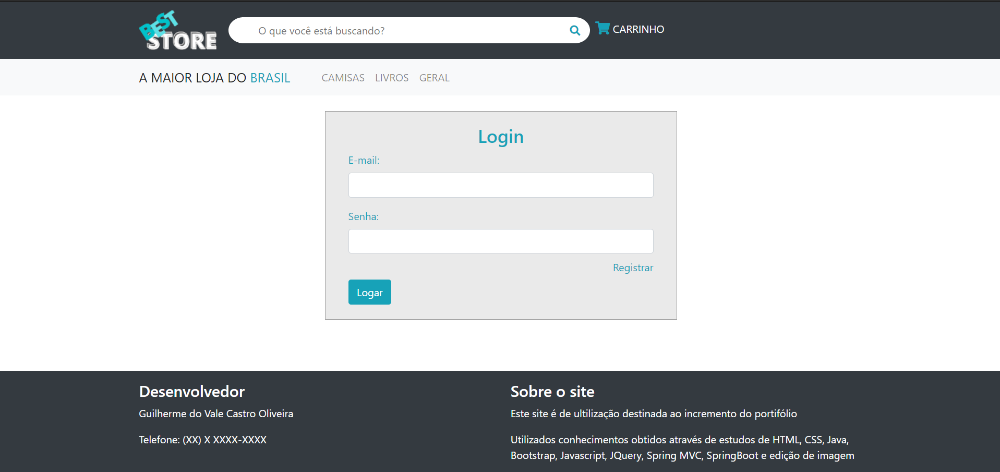

# LojaGenerica
Projeto de uma loja feita com spring boot utilizando maven, bootstrap, spring security, html, css e mysql que faz um pagamento com um servidor rest criado por mim cujo projeto se encontra também nesse perfil.

Clicando em "LOGAR" o usuário entra na tela de login onde pode ter login de usuário e admin que têm seus nomes e opções mostradas, assim como opção de deslogar.

Caso não tenha cadastrado nenhum usuário, ele pode ser cadastrado clicando em "Registrar" na tela de login

Na tela de cadastro de usuário, o usuário deve informar os dados e senha. Ao finalizar o registro ele poderá logar-se

Na tela de usuário (user) você tem as opções de favoritos (não habilitada ainda) e a do CARRINHO. Também pode ser realizadas buscas e compras.

Ao visualizar e adicionar os produtos no carrinho, o usuário deverá decidir na finalização do pagamento. O servidor simulando um banco irá validar o pagamento e retornar o sucesso ou não da transação.

Na tela de usuario (admin) tem a opção de CADASTRAR habilitada. Ao clicar nela você irá para uma tela para digitar informações dos produtos que deseja cadastrar. E não poderá realizar compras.

